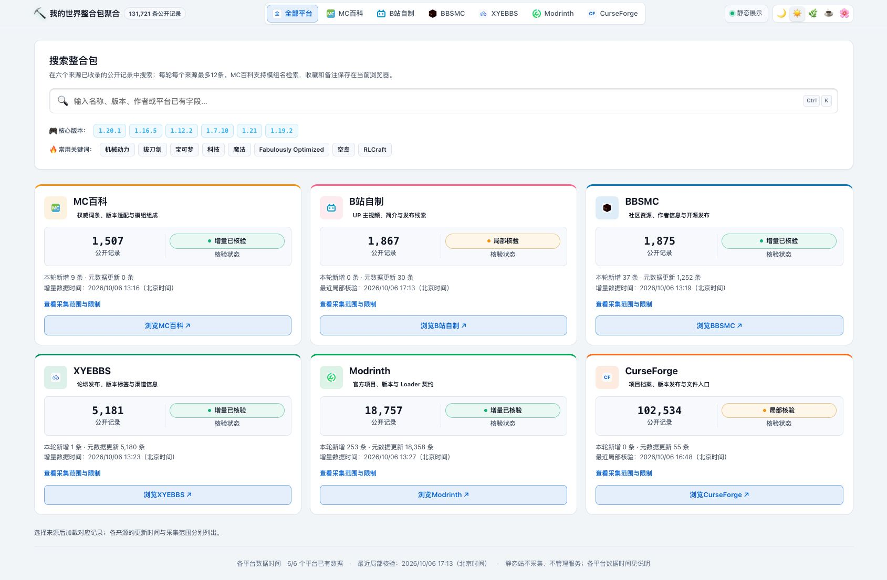
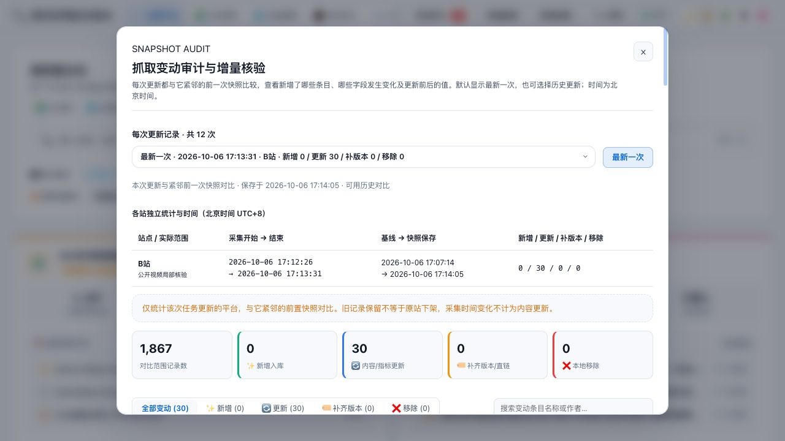
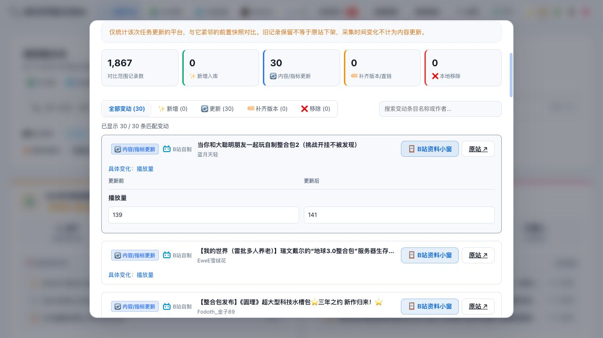
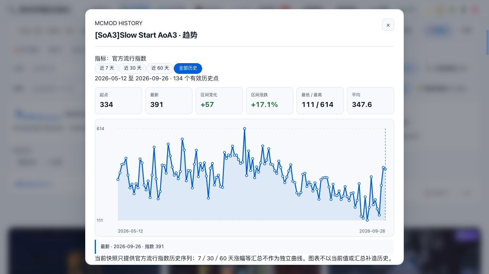

# 我的世界整合包聚合

**把六个来源的 Minecraft 整合包资料放在一个工作台里：搜索、筛选、查看版本与模组、比较来源，保存自己的游玩计划，并追踪每次更新的具体变化。**

[在线浏览](https://suifracti.github.io/mc-modpack-crawler-board/) · [本地 V2 启动](#启动本地-v2) · [数据更新](#六站统一更新) · [变动审计](#每次更新变了什么) · [开发文档](#开发与交付文档)

Python 负责采集和数据整理，TypeScript / Vite 提供界面，Node.js 提供本地服务。当前默认开发分支是 **`master`**，网页发布分支是 **`gh-pages`**；当前交付形态为浏览器工作台，不交付 Electron / EXE 安装包。



*2026-10-06 实际线上截图。各站计数、观察时间和覆盖范围独立显示；打开页面不会自动抓取新数据。*

## 可以做什么

- **查找整合包**：跨来源搜索，按 Minecraft 版本、Loader、分类和个人状态筛选；MC百科还支持按收录模组检索。提供卡片、紧凑和表格视图。
- **查看已有资料**：详情抽屉和小窗展示保存的正文、图片、版本说明、模组及原站入口，左右资料面板可收起，小窗可最小化或最大化。
- **核对其他来源**：用已有中文名搜索对应外站名称，查看名称匹配和原页链接形成的关联线索，保留每条记录的平台身份；同名线索不自动认定为同一个整合包。
- **查看下载来源**：卡片、摘要和详情标注实际保存的百度、夸克等网盘、站内文件或原站页面；未收录链接会明确显示缺失，不把项目页当作文件下载。
- **整理个人库**：收藏、想玩、玩过、评分和备注；本地服务支持个人资料备份与恢复，个人状态与公开采集记录分开保存。
- **统一更新六站**：在同一更新中心选择日常增量、旧包资料补全或目录核对，任务按站串行执行，每站结果独立保存。
- **逐次检查变化**：每次保存的更新与紧邻的前置快照比较，查看新增条目、内容或指标变化、版本与链接补充、本地移除，以及具体字段前后值。
- **查看历史趋势**：MC百科有真实历史序列的项目可从卡片或详情打开走势图，按时间范围查看指数与区间统计。

功能是否有内容，取决于对应来源和本地存档。没有保存的作者、正文、评论、版本或历史点会保持缺失，不用推测值填充。

## 线上站与本地服务

| 能力 | GitHub Pages 在线站 | 本地 V2 服务 |
| --- | --- | --- |
| 浏览与搜索六站资料 | 发布时的公开资料 | 当前本地快照 |
| 正文、图片、版本、关联来源与已有趋势 | 已导出的公开存档 | 已保存的本地资料 |
| 收藏、评分、游玩状态和备注 | 当前访问者浏览器 localStorage | 仓库外的本地个人库 |
| 执行采集更新与查看队列结果 | 不提供 | 提供 |
| 逐次快照变动审计 | 不提供 | 提供 |
| 导入资料、切换快照、个人库备份恢复 | 不提供 | 提供 |

在线站是静态资料展示。网站发布不会上传维护者的个人库，也不会在 GitHub Pages 上运行爬虫或本地服务。原站访问和远程图片是否可用仍取决于来源网站。

## 六个来源与当前资料

以下为 **2026-10-06 已发布快照**，合计 **131,721 条来源记录**。计数包含历史存档和待核验记录，各平台分别计数，不能解释为去重后的整合包总数或全站实时覆盖。

| 来源 | 记录数 | 主要资料 | 当前更新范围 |
| --- | ---: | --- | --- |
| MC百科 | 1,507 | 词条、版本适配、模组组成、流行指数历史 | 最新一轮新增 ID 探测得到 9 条；未刷新所有旧项目指标 |
| 哔哩哔哩 | 1,867 | 视频简介、UP 主、发布线索和可见指标 | 最近一轮核验 30 个已存公开视频，0 次请求失败；仍有待核验存档 |
| BBSMC | 1,875 | 社区项目、版本与作者资料 | 已完成近期增量更新 |
| XYEBBS | 5,181 | 论坛发布、版本标签与来源链接 | 已完成近期增量更新 |
| Modrinth | 18,757 | 项目、版本、Loader 与图库 | 已完成近期增量更新 |
| CurseForge | 102,534 | 历史项目档案、文件元数据及第三方公开资料 | 已核对第三方目录；最新一轮为近期 2 页及对应详情，非官方全历史 |

来源时间、采集观察时间和快照保存时间含义不同。请以更新中心、变动审计和线上站的各站范围说明为准；旧资料在新快照中保留，不代表当天重新核验过。

### B站与 CurseForge 的更新方式

**B站**通过主站公开 HTML 核验已存视频，保留原始身份和旧资料。日常任务轮换核验最多 30 个候选，目录核对最多 5,000 个已有视频 ID，跳过当天已尝试和已确认不可用项。它不通过受限关键词 API 执行全站搜索；视频新发也不等于整合包新版本。访问拒绝和验证页会停止任务，单个确认不可见的视频保留记录并隔离，拒绝账本不会为重试而清空。

发现新视频时，在 **数据更新 → B站官方浏览器发现 / 登录** 打开系统默认浏览器中的官方搜索页。使用原来的 B站账户正常登录、按最新发布筛选，把官方视频链接或 BVID 粘贴进队列。下次正常更新会核验这些视频和官方合集，再轮换检查已有视频；队列会去重并跨任务保留。登录状态留在官方浏览器，服务不读取浏览器 Cookie。这个入口补充新包发现，仍不能保证搜索结果覆盖全站。

默认列表只展示发布、更新与预告线索；分享、推荐、介绍和转载在单独筛选中展示，不作为 UP 主原创发布。明确声称自制的分享可保留发布线索，作者归属仍需原页核验。实况、单模组、教程和获取导流另列，全部存档保留。标题不必写“整合包发布”，但必须有 MC 与整合包依据。视频发布时间与本地简介核查时间分别显示，避免把一次新视频误当作整合包版本更新。

**CurseForge**在没有官方 Key 时，目录更新使用 Modpacks.ch 第三方公开目录：日常读取近期 2 页，目录核对最多读取该提供方的 200 页公开窗口，项目正文和图片随详情保存。旧包文件资料另有 CFWidget 已知 ID 缓存路径；这些缓存和目录都不等同于官方完整版本历史。有自己的官方 Key 时可配置官方元数据接口，Key 留在本机。提供方配置和边界见 [CurseForge 说明](docs/CURSEFORGE_API.md)。

## 启动本地 V2

### 环境

需要 Git、Node.js、npm、Python 3 和现代浏览器。当前 Mac 实测环境为 **Node.js 24.18.0 / npm 11.16.0 / Python 3.14.6**。桌面服务及当前 B站公开 HTML、CF 元数据路径使用 Python 标准库；旧采集脚本的可选依赖见 [开发说明](docs/DEVELOPMENT.md)。

### 新建源码目录并启动

下面是 macOS / Linux 的显式 V2 入口。已有工作目录时直接进入该目录，先检查未提交修改，不重复 clone 或覆盖已有数据。

```sh
git clone --branch master https://github.com/suifracti/mc-modpack-crawler-board.git
cd mc-modpack-crawler-board

npm --prefix apps/web ci
npm --prefix apps/web run build:desktop-v2

MC_DATA_DIR="$HOME/Library/Application Support/MCModpackBoard/data"
node apps/desktop/server.cjs --host 127.0.0.1 --port 8765 \
  --frontend-root "$PWD/build/desktop-v2/frontend" \
  --data-root "$MC_DATA_DIR" \
  --python "$(command -v python3)" --no-open
```

浏览器打开 **[本地 V2 页面](http://127.0.0.1:8765/)**。保留服务终端，按 `Ctrl+C` 停止。Linux 可把 `MC_DATA_DIR` 改为仓库外的 `"$HOME/.local/share/MCModpackBoard/data"`；Windows 的参数、数据位置见 [本地服务说明](apps/desktop/README.md)。

Git clone 只取得源码，**不会附带已采集数据、私人收藏或完整历史快照**。没有本地资料时会显示空数据状态；已有资料通过“选择数据／更换数据”导入，或按恢复指引使用完整副本。不要用 Windows 的路径或 active 指针直接替代当前机器的数据目录。

服务当前没有登录保护；本机使用时保持上面的 `--host 127.0.0.1`。仅用 `python -m http.server` 能展示生成网页，但不能提供更新、审计和个人库 API。

### 已恢复 Mac 环境的固定入口

本项目当前维护环境继续使用以下位置，目录名虽然保留迁移日期，开发分支已经是 `master`：

| 项目 | 位置 |
| --- | --- |
| 源码 | `$HOME/backup/ai/work/zhenghebao/mac-integration-20261005` |
| 运行数据 | `$HOME/Library/Application Support/MCModpackBoard-migration-20261006/data` |
| 本机启动器 | `$HOME/backup/ai/work/zhenghebao/start-mc-v2.command` |

启动器在仓库外，只在已恢复的 Mac 上存在；它不会随 clone 自动生成。已运行服务时直接打开本地页面，避免重复占用 8765 端口。

更新源码并重新构建：

```sh
cd "$HOME/backup/ai/work/zhenghebao/mac-integration-20261005"
git status --short
# 工作区无冲突后，再同步主线。
git pull --ff-only origin master
npm --prefix apps/web run build:desktop-v2
```

构建后重启服务，沿用已有运行数据目录。仓库根目录旧 `start_browser_service.*` 和 `npm --prefix apps/desktop start` 默认走 V1，当前 V2 使用上述显式入口。

本机 Python 曾出现默认 CA 文件缺失；已恢复 Mac 启动器局部设置 `SSL_CERT_FILE=/etc/ssl/cert.pem` 使用系统证书。遇到同样问题时先检查证书位置，保留 TLS 校验，不用关闭验证解决。

恢复包校验、生产快照与近期增量的区别、个人数据冲突处理见 [Mac 恢复与交接](docs/MAC_MIGRATION.md)。Windows 的全历史和旧工作树仍保留，不是本地最小运行必需项。

## 六站统一更新

1. 在本地 V2 顶部打开 **数据更新**。
2. 选择场景：**快速日常增量更新**、**旧包版本与网盘补全**或**平台目录核对**。
3. 选择需要的来源；“全选”会选中六站。
4. 开始执行后查看每站的实际覆盖、观察数量、失败原因和保存结果。
5. 更新保存后打开 **变动审计**，检查这次相对前一次的变化。


*截图只展示场景和六站选择，本次拍图没有启动新采集。*

任务串行执行，单站失败继续其余已选平台；取消会停止剩余任务。队列在本地服务运行期间管理，刷新页面不会丢失结果；服务重启保留历史结果，不自动重新发起中断采集。每站使用自己的更新范围，选择“目录核对”也不自动获得全站完整覆盖。

新快照保留未观察到的旧条目。范围之外没有见到的记录不会直接解释为原站下架，第三方未返回的字段不会覆盖成空值。

**2026-10-07 源码更新后的日常范围**：MC百科复查 50 个旧包并探测新增；B站核验最多 30 个候选／已有视频；BBSMC、XYEBBS核对完整目录，只读取新增、变更和轮换的 50 个旧包版本；Modrinth核对完整目录，项目与版本 ID 一致时复用已核实发布资料；CF读取近期 2 页。目录核对仍是更大范围的独立任务，不能用日常覆盖冒充全站完成。

减少重复请求之外，隔离快照可在验证输入哈希、数据库完整性及流水线版本后只重建选中来源；条件不满足时回退完整构建。B站每 30 次有效观察保存中途资料，CF近期任务与较长目录断点分开保存。中途保存不等于已发布快照，失败和局部覆盖继续单独记录。

最近一次本地六站批次为 **1 站完整、2 站局部保存、3 站失败并保留旧数据**：MC百科已保存；B站因传输超时停止；CF保存第三方目录前 124/200 页，尚缺终末覆盖与首尾漂移验证；BBSMC、XYEBBS与Modrinth遇到本机 CA 问题。可信 CA 加载已修复，但没有再次运行完整六站批次验证。因此这次源码同步不表示六站已全量更新，也不改变上面 10 月 6 日的线上发布快照。

## 每次更新变了什么

**“一次”指一个实际保存的更新任务。** 默认展示最新一次，也可从更新记录中选择上一次、上上次或更早的任务；每个任务都与它紧邻的前置快照相比。六站依次更新会形成各站自己的任务记录，不把它们伪装成同一时间的六站全量刷新。



审计分为新增入库、内容／指标更新、补齐版本／直链、本地移除。列表可按类型和名称筛选，展开“具体变化”查看字段的更新前后值，还能打开来源资料。

<details>
<summary>查看字段前后值示例：播放量 139 → 141</summary>



</details>

采集开始、采集结束、基线和快照保存时间分别显示，审计时间为北京时间 UTC+8，精确到秒。只有采集时间变化不计作内容更新；未保存的失败任务不伪造为已更新。缺少对应旧快照时会明确提示不能计算，而不是用零变动冒充对比成功。

## 资料小窗与历史趋势

从卡片进入小窗，可以切换 **资料、版本历史、图片、其他来源和原站入口**。资料取自保存的正文与索引；图片合并原图库和已有正文里的 HTTP(S) 图片地址，按地址去重。相同图片若使用不同地址仍可能重复，远程图片也可能因来源访问限制不可显示。


*本地样例“虚饰作品”：27 条版本说明、321 条模组关系和 10 张图片。数量描述该样例，不代表所有项目资料同样完整；右侧个人区未展开。*

MC百科卡片和详情里的 **历史趋势**按钮使用相同的已有序列。可查看近 7／30／60 天或全部历史，查看日期、指数和区间统计；近几天以保存序列的末端日期为依据，不补造没有观测过的点。

<details>
<summary>查看从卡片打开的完整走势图</summary>



*样例有 134 个有效点，末端为 2026-09-26。10 月 6 日更新或发布快照，不会把旧序列变成当天已采集的趋势。*

</details>

B站视频播放器和外站网页在内嵌小窗中仍有兼容限制；已保存资料可独立查看，播放与完整讨论使用“浏览器打开”前往原站。

## 数据、隐私与发布

运行快照、个人库、收藏更新状态、采集拒绝账本、凭据和原始证据留在仓库之外。公开截图仅展示公开来源资料及功能界面，没有个人收藏或备注。

公开站采用精确文件清单发布：仅导出允许的公开字段、必要资源和已有预览；本地地址在导出副本中脱敏，原始资料保持原样。详细流程见 [静态站交付](docs/STATIC_PAGES.md)。

源码同步与网站部署分开进行：正常推送 `master` 更新源码，网站继续从 **`gh-pages` 根目录**发布。只推送 `master` 不会更新当前 Pages。不要把整个 `build/`、运行数据目录或私人交付 ZIP 上传为发布产物。

## 开发与交付文档

| 路径 | 用途 |
| --- | --- |
| `apps/web/` | V2 前端、静态站入口、公开导出和前端测试 |
| `apps/desktop/` | Node.js 本地服务、更新队列、快照与个人库 |
| `apps/desktop/collector_worker.py`、各平台采集器 | 来源采集与任务执行 |
| `pipeline/` | Canonical SQLite、适配、转换与导出 |
| `web/`、`多平台聚合转换器_v1.0.py` | 共用样式及旧转换兼容路径 |
| `tests/`、`pipeline/tests/` | Python 测试；部分依赖已有本地样本 |
| `docs/` | 契约、当前状态、交接和历史证据 |
| `docs/images/` | 本 README 的实际界面截图及来源说明 |

常用检查，在仓库根目录运行：

```sh
npm --prefix apps/web test
npm --prefix apps/web run build:desktop-v2
node --test apps/desktop/test/snapshot-audit.test.cjs
node --test apps/desktop/test/pages-export.test.cjs apps/desktop/test/public-data-redaction.test.cjs
```

2026-10-06 发布前检查：Web 单测 120/120，Desktop 相关用例 46/46，B站 31/31（含已保存 HTML），CF 12/12，公开导出及脱敏用例 2/2；V2 和 Pages 构建通过。上线后核对 117 个发布文件的 Git 对象，21 个关键 HTTP 文件哈希一致，并抽查 B站／CF 卡片、详情与图片。这些证据不代表全仓安全审计、六站所有详情、真实官方鉴权或完整历史全部通过。

2026-10-07 源码同步检查：Web 单测 132/132，服务相关用例 49/49，Python 相关用例 111 项中通过 110、跳过 1 项本机 HTML 样本；V2 类型检查与构建通过。旧 `test_collector_worker.py` 的 2 个断言失败、4 个错误在干净的同步前 `master` 上同样复现，尚待单独处理；不计作本次检查通过，也未为消除失败而改写旧断言。上述验证没有重新访问六站或部署网站。

详细阅读：

- [当前实施状态](docs/PROJECT_STATE.md)：当前能力与历史验收边界，以顶部最新记录为准。
- [开发说明](docs/DEVELOPMENT.md)：数据流水线和旧路径。
- [本地服务](apps/desktop/README.md)：参数与 API 服务说明，V2 入口以本 README 为准。
- [搜索契约](docs/SEARCH_CONTRACT.md)：搜索、筛选和字段语义。
- [CurseForge 提供方](docs/CURSEFORGE_API.md)：第三方与官方接口的范围和配置。
- [静态站交付](docs/STATIC_PAGES.md)：只读构建与公开发布清单。
- [Mac 交接](docs/MAC_MIGRATION.md)、[分支整合记录](docs/BRANCH_INTEGRATION_20261005.md)：恢复与保留依据，不作为重放旧候选的指令。

独立 A／B 候选尚未采用：A 的安全审计受限，B 的兼容与切换未验。PR #21 经等价核对关闭，重复分支已删除，未通过强行合并收敛分支。后续开发使用 `master`，`gh-pages` 继续用于网站。

## 使用与许可

本项目不是 MC百科、Minecraft、Mojang、Microsoft 或任何整合包作者的官方工具，与这些平台或作者没有合作关系。采集脚本未获得第三方数据源的官方授权；请遵守来源规则，采用个人学习、本地整理和低频更新方式，不绕过访问限制。

排序、指数、趋势和评论整理仅用于信息组织，不代表对作品质量的官方评价。第三方整合包、模组、图片、网页和评论的权利属于原权利人。

本仓库的代码、文档、配置与提交过程由 AI 完整生成或实质完成，人类维护者未逐行编写或背书。已有检查有明确范围，AI 输出仍可能错误、不完整或不安全，使用前请自行审查与测试。

**未授予开源许可（No open-source license is granted）。** 仓库仅供个人学习与技术参考；本说明不授权商用或再分发完整采集数据，也不授予任何第三方材料的使用权。
